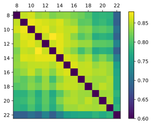
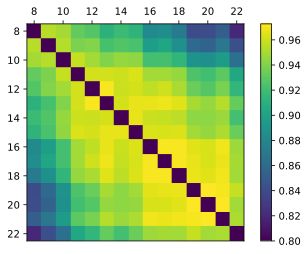
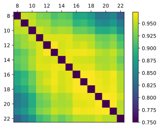
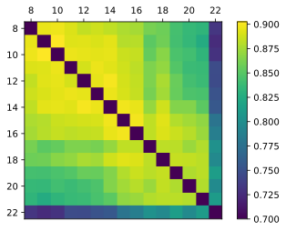
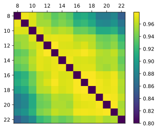
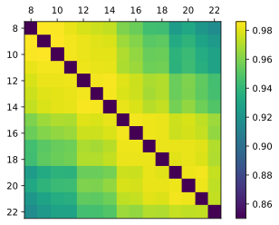

# 目录结构

一级目录或文件如下：

| 名称 | 用途 |
| ---- | ---- |
| archive | 归档的实验性脚本 |
| data | 包含被试信息文件，也用于存储输出数据 |
| diagrams | 分析流程图示 |
| figures | 分析图表 |
| lib | 方法库 |
| \*.ipynb | 分析脚本 |
| HCPD.py | 当前的主要方法库 |

目前计划将HCPD.py拆分到lib中。

# 分析代码

## 2021-01-22-HCPD-Analysis

求出各年龄的平均髓鞘化图谱，并作两两比较，生成相关矩阵，分析流程如下图。

其中，新旧流程的区别在于处理极端值的顺序。

根据旧流程绘制的图为：

- 小脑，figures/1611309433199.svg

- 大脑皮层，figures/1611315848938.svg

- 皮下核团，figures/1611392678211.svg

- 合并，figures/Edited/1611655120159.drawio.svg

根据新流程绘制的图为：

- 小脑，figures/1612182966245.svg

- 大脑皮层，figures/1611315848938.svg

- 皮下核团，figures/1611392678211.svg

- 合并，figures/Edited/1612231073682.drawio.svg

